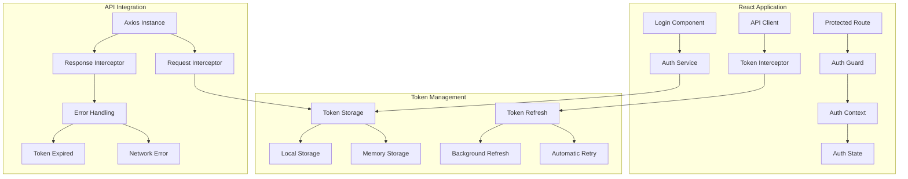
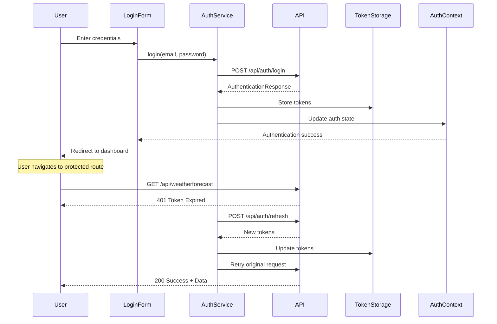
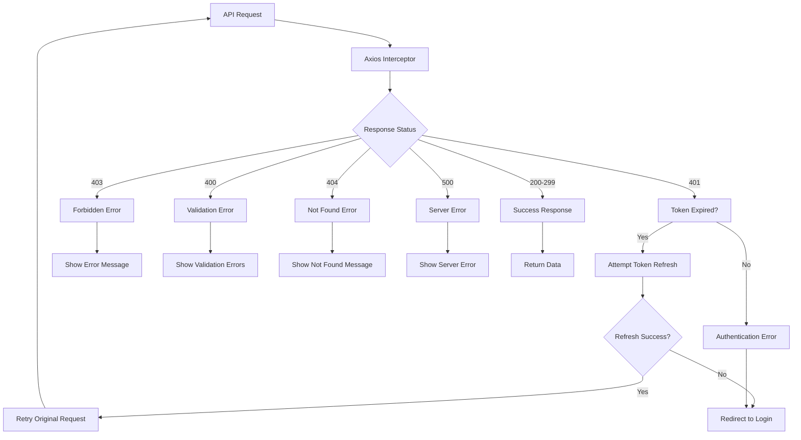

# Frontend API Authentication Structure Design

## Overview

This design implements a comprehensive frontend authentication system that integrates with the WorkoutProject API. The solution includes JWT token management, automatic refresh token handling, API client configuration, and React-based authentication flows following Feature-Sliced Design (FSD) architecture.

## Architecture

### Frontend Authentication Architecture



### Authentication Flow



### Frontend Response Type Handling

The frontend handles two different API response patterns:

#### 1. Authentication Responses (Direct Format)
```typescript
// Authentication Success Response
interface AuthenticationResponse {
  accessToken: string;
  refreshToken: string;
  accessTokenExpiry: string;
  refreshTokenExpiry: string;
  user: UserDto;
}

// Authentication Error Response
interface AuthenticationErrorResponse {
  error: string;
  errorDescription: string;
  statusCode: number;
}
```

#### 2. Standard API Responses (Wrapped Format)
```typescript
// Standard API Response Wrapper
interface ApiResponse<T> {
  success: boolean;
  data: T;
  message?: string;
  errors?: string[];
  pagination?: PaginationMetadata;
}

// Weather Forecast Response Example
interface WeatherForecast {
  date: string;
  temperatureC: number;
  temperatureF: number;
  summary: string;
}
```

## Components and Interfaces

### 1. Authentication Service Layer

#### AuthService Interface
```typescript
interface IAuthService {
  login(credentials: LoginRequest): Promise<AuthenticationResponse>;
  refreshToken(): Promise<AuthenticationResponse>;
  logout(): Promise<void>;
  getCurrentUser(): UserDto | null;
  isAuthenticated(): boolean;
  getAccessToken(): string | null;
}
```

#### Token Storage Interface
```typescript
interface ITokenStorage {
  setTokens(tokens: TokenData): void;
  getAccessToken(): string | null;
  getRefreshToken(): string | null;
  clearTokens(): void;
  isTokenExpired(token: string): boolean;
}
```

### 2. API Client Components

#### Axios Configuration
```typescript
interface ApiClientConfig {
  baseURL: string;
  timeout: number;
  withCredentials: boolean;
  headers: Record<string, string>;
}

interface RequestInterceptor {
  onFulfilled: (config: AxiosRequestConfig) => AxiosRequestConfig;
  onRejected: (error: any) => Promise<any>;
}

interface ResponseInterceptor {
  onFulfilled: (response: AxiosResponse) => AxiosResponse;
  onRejected: (error: AxiosError) => Promise<any>;
}
```

### 3. React Authentication Components

#### AuthContext Interface
```typescript
interface AuthContextType {
  user: UserDto | null;
  isAuthenticated: boolean;
  isLoading: boolean;
  login: (credentials: LoginRequest) => Promise<void>;
  logout: () => Promise<void>;
  refreshToken: () => Promise<void>;
}
```

#### Protected Route Component
```typescript
interface ProtectedRouteProps {
  children: React.ReactNode;
  requiredRole?: UserRole;
  fallback?: React.ReactNode;
}
```

## Data Models

### Authentication Types

```typescript
// Request Types
interface LoginRequest {
  email: string;
  password: string;
  rememberMe?: boolean;
}

interface RefreshTokenRequest {
  refreshToken: string;
}

// Response Types
interface AuthenticationResponse {
  accessToken: string;
  refreshToken: string;
  accessTokenExpiry: string;
  refreshTokenExpiry: string;
  user: UserDto;
}

interface AuthenticationErrorResponse {
  error: string;
  errorDescription: string;
  statusCode: number;
}

// User Types
interface UserDto {
  id: string;
  email: string;
  firstName: string;
  lastName: string;
  role: UserRole;
  permissions: string[];
}

enum UserRole {
  Admin = 'Admin',
  Trainer = 'Trainer',
  Athlete = 'Athlete',
  Nutritionist = 'Nutritionist'
}

// Token Storage Types
interface TokenData {
  accessToken: string;
  refreshToken: string;
  accessTokenExpiry: string;
  refreshTokenExpiry: string;
}
```

### API Response Types

```typescript
// Standard API Response Wrapper
interface ApiResponse<T> {
  success: boolean;
  data: T;
  message?: string;
  errors?: string[];
  pagination?: PaginationMetadata;
}

// Pagination Types
interface PaginationMetadata {
  page: number;
  pageSize: number;
  totalCount: number;
  totalPages: number;
  hasNextPage: boolean;
  hasPreviousPage: boolean;
}

// Error Types
interface ValidationError {
  field: string;
  message: string;
  attemptedValue?: any;
}

// Weather Forecast Test Types
interface WeatherForecast {
  date: string;
  temperatureC: number;
  temperatureF: number;
  summary: string;
}
```

## Error Handling

### Frontend Error Handling Strategy

```typescript
// Error Types
interface ApiError {
  message: string;
  statusCode: number;
  errors?: ValidationError[];
}

interface AuthenticationError extends ApiError {
  error: string;
  errorDescription: string;
}

// Error Handler Interface
interface IErrorHandler {
  handleAuthError(error: AuthenticationError): void;
  handleApiError(error: ApiError): void;
  handleNetworkError(error: Error): void;
}
```

### Error Handling Flow



### Error Categories

1. **Authentication Errors (401)**:
   - Invalid credentials
   - Token expired
   - Token invalid

2. **Authorization Errors (403)**:
   - Insufficient permissions
   - Role-based access denied

3. **Validation Errors (400)**:
   - Field validation failures
   - Required field missing
   - Invalid format

4. **Network Errors**:
   - Connection timeout
   - Network unavailable
   - CORS errors

## Testing Strategy

### Frontend Testing Approach

#### Unit Testing
- **Auth Service Tests**: Login, logout, token refresh functionality
- **Token Storage Tests**: Token persistence and retrieval
- **API Client Tests**: Request/response interceptors
- **Component Tests**: Login form, protected routes, auth guards

#### Integration Testing
- **Authentication Flow Tests**: Complete login/logout workflows
- **API Integration Tests**: Real API calls with mock responses
- **Token Refresh Tests**: Automatic token refresh scenarios
- **Error Handling Tests**: Various error response scenarios

#### E2E Testing
- **User Authentication Journey**: Login → Protected Route → Logout
- **Token Expiration Handling**: Automatic refresh during navigation
- **Role-Based Access**: Different user roles accessing appropriate content

### Test Implementation Examples

#### Auth Service Test
```typescript
describe('AuthService', () => {
  it('should login successfully with valid credentials', async () => {
    const mockResponse: AuthenticationResponse = {
      accessToken: 'mock-access-token',
      refreshToken: 'mock-refresh-token',
      accessTokenExpiry: '2024-01-01T12:00:00Z',
      refreshTokenExpiry: '2024-01-08T12:00:00Z',
      user: mockUser
    };
    
    apiClient.post.mockResolvedValue({ data: mockResponse });
    
    const result = await authService.login({ email: 'test@test.com', password: 'password' });
    
    expect(result).toEqual(mockResponse);
    expect(tokenStorage.setTokens).toHaveBeenCalledWith(mockResponse);
  });
});
```

#### Protected Route Test
```typescript
describe('ProtectedRoute', () => {
  it('should redirect to login when not authenticated', () => {
    const { getByText } = render(
      <AuthContext.Provider value={{ isAuthenticated: false, user: null }}>
        <ProtectedRoute>
          <div>Protected Content</div>
        </ProtectedRoute>
      </AuthContext.Provider>
    );
    
    expect(mockNavigate).toHaveBeenCalledWith('/login');
  });
});
```

### Weather Forecast Test Integration

The WeatherForecast endpoint serves as a test endpoint to verify authentication:

```typescript
// API call example
const getWeatherForecast = async (): Promise<ApiResponse<WeatherForecast[]>> => {
  const response = await apiClient.get<ApiResponse<WeatherForecast[]>>('/weatherforecast');
  return response.data;
};

// Component usage example
const WeatherTest: React.FC = () => {
  const [weather, setWeather] = useState<WeatherForecast[]>([]);
  const [loading, setLoading] = useState(false);
  const [error, setError] = useState<string | null>(null);

  const fetchWeather = async () => {
    try {
      setLoading(true);
      const response = await getWeatherForecast();
      if (response.success) {
        setWeather(response.data);
      } else {
        setError(response.message || 'Failed to fetch weather');
      }
    } catch (err) {
      setError('Authentication required or network error');
    } finally {
      setLoading(false);
    }
  };

  return (
    <div>
      <button onClick={fetchWeather}>Test Authentication</button>
      {loading && <p>Loading...</p>}
      {error && <p>Error: {error}</p>}
      {weather.map((forecast, index) => (
        <div key={index}>
          {forecast.date}: {forecast.summary} ({forecast.temperatureC}°C)
        </div>
      ))}
    </div>
  );
};
```

## Security Considerations

### Frontend Token Security
- **Secure Storage**: Access tokens in memory, refresh tokens in httpOnly cookies or secure localStorage
- **Token Expiration**: Automatic refresh before expiration
- **XSS Protection**: Sanitize all user inputs and use Content Security Policy
- **CSRF Protection**: Use proper CORS configuration and anti-CSRF tokens

### Client-Side Security Measures
- **HTTPS Only**: All API communication over secure connections
- **Token Validation**: Validate token format and expiration before API calls
- **Automatic Logout**: Clear tokens on suspicious activity or errors
- **Session Management**: Handle multiple tabs/windows gracefully

### Environment Security
- **Environment Variables**: Store API URLs and keys in environment variables
- **Build-time Security**: Remove debug information in production builds
- **Runtime Security**: Implement proper error boundaries and fallbacks

## Configuration

### Environment Configuration
```typescript
// .env files
// .env.development
VITE_API_BASE_URL=http://localhost:7207/api
VITE_WEBSOCKET_URL=ws://localhost:7207/hub
VITE_TOKEN_REFRESH_THRESHOLD=300000 // 5 minutes in milliseconds

// .env.production
VITE_API_BASE_URL=https://api.workoutproject.com/api
VITE_WEBSOCKET_URL=wss://api.workoutproject.com/hub
VITE_TOKEN_REFRESH_THRESHOLD=300000
```

### API Client Configuration
```typescript
// api/config.ts
export const apiConfig = {
  baseURL: import.meta.env.VITE_API_BASE_URL,
  timeout: 30000,
  withCredentials: true,
  headers: {
    'Content-Type': 'application/json',
    'Accept': 'application/json'
  }
};

// Token refresh configuration
export const tokenConfig = {
  refreshThreshold: parseInt(import.meta.env.VITE_TOKEN_REFRESH_THRESHOLD) || 300000,
  maxRetries: 3,
  retryDelay: 1000
};
```

### React App Configuration
```typescript
// app/providers/AuthProvider.tsx
const AuthProvider: React.FC<{ children: React.ReactNode }> = ({ children }) => {
  const [authState, setAuthState] = useState<AuthState>({
    user: null,
    isAuthenticated: false,
    isLoading: true
  });

  // Initialize auth state from storage
  useEffect(() => {
    const initializeAuth = async () => {
      const token = tokenStorage.getAccessToken();
      if (token && !tokenStorage.isTokenExpired(token)) {
        const user = await authService.getCurrentUser();
        setAuthState({ user, isAuthenticated: true, isLoading: false });
      } else {
        setAuthState({ user: null, isAuthenticated: false, isLoading: false });
      }
    };

    initializeAuth();
  }, []);

  return (
    <AuthContext.Provider value={{ ...authState, ...authActions }}>
      {children}
    </AuthContext.Provider>
  );
};
```