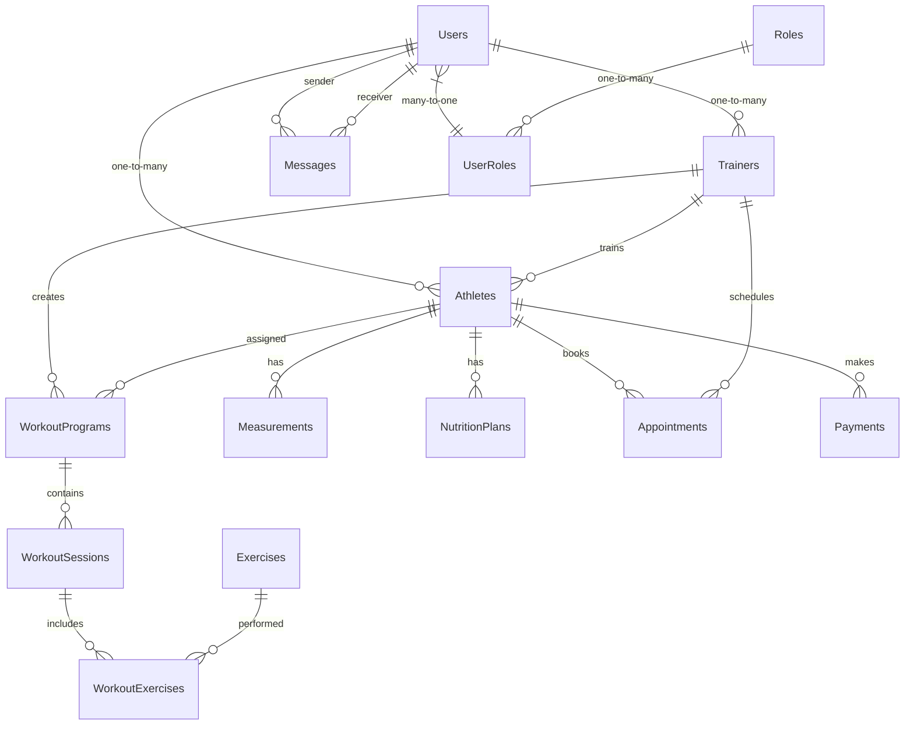

# Trainer-Athlete Tracking System - Backend Documentation

## Table of Contents
1. [Architecture Overview](#architecture-overview)
2. [Technology Stack](#technology-stack)
3. [Project Structure](#project-structure)
4. [Database Design](#database-design)
5. [Entity Models](#entity-models)
6. [Repository Pattern](#repository-pattern)
7. [Services Layer](#services-layer)
8. [API Endpoints](#api-endpoints)
9. [Authentication & Authorization](#authentication--authorization)
10. [Middleware](#middleware)
11. [Background Services](#background-services)
12. [Caching Strategy](#caching-strategy)
13. [Logging](#logging)
14. [Configuration](#configuration)
15. [Testing](#testing)
16. [Deployment](#deployment)

## Architecture Overview

The backend follows Clean Architecture principles with clear separation of concerns:

```
┌─────────────────────────────────────────────────┐
│                 Presentation Layer              │
│              (API Controllers)                  │
├─────────────────────────────────────────────────┤
│                Application Layer                │
│            (Services & DTOs)                    │
├─────────────────────────────────────────────────┤
│                  Domain Layer                   │
│             (Entities & Interfaces)             │
├─────────────────────────────────────────────────┤
│               Infrastructure Layer              │
│          (Data Access & External Services)      │
└─────────────────────────────────────────────────┘
```

## Technology Stack

### Core Framework
- **ASP.NET Core 8.0**: Main framework
- **C# 12**: Programming language
- **.NET 8**: Runtime environment

### Database & ORM
- **SQL Server**: Primary database
- **Entity Framework Core 8**: ORM
- **Redis**: Caching and session storage

### Authentication & Security
- **JWT Bearer Tokens**: Authentication
- **ASP.NET Core Identity**: User management
- **BCrypt**: Password hashing
- **FluentValidation**: Input validation

### Communication
- **SignalR**: Real-time communication
- **AutoMapper**: Object mapping
- **MediatR**: CQRS pattern implementation

### Background Processing
- **Hangfire**: Background job processing
- **Quartz.NET**: Scheduled tasks

### Logging & Monitoring
- **Serilog**: Structured logging
- **Application Insights**: Monitoring (Azure)
- **Health Checks**: Application health monitoring

### Testing
- **xUnit**: Unit testing framework
- **Moq**: Mocking framework
- **FluentAssertions**: Assertion library
- **TestContainers**: Integration testing

## Project Structure

```
src/
├── TrainerAthleteSystem.Api/              # Web API project
│   ├── Controllers/                       # API controllers
│   ├── Middlewares/                       # Custom middleware
│   ├── Filters/                          # Action filters
│   ├── Hubs/                             # SignalR hubs
│   ├── Extensions/                       # Service extensions
│   └── Program.cs                        # Application entry point
├── TrainerAthleteSystem.Application/      # Application layer
│   ├── Services/                         # Business logic services
│   ├── DTOs/                             # Data transfer objects
│   ├── Interfaces/                       # Service interfaces
│   ├── Commands/                         # CQRS commands
│   ├── Queries/                          # CQRS queries
│   ├── Handlers/                         # Command/Query handlers
│   ├── Validators/                       # FluentValidation validators
│   └── Mappings/                         # AutoMapper profiles
├── TrainerAthleteSystem.Domain/           # Domain layer
│   ├── Entities/                         # Domain entities
│   ├── Enums/                            # Enumerations
│   ├── Interfaces/                       # Repository interfaces
│   ├── ValueObjects/                     # Value objects
│   └── Exceptions/                       # Custom exceptions
├── TrainerAthleteSystem.Infrastructure/   # Infrastructure layer
│   ├── Data/                             # EF Core context & migrations
│   ├── Repositories/                     # Repository implementations
│   ├── Services/                         # External service implementations
│   ├── Configurations/                   # Entity configurations
│   └── Seeders/                          # Data seeders
└── TrainerAthleteSystem.Shared/           # Shared utilities
    ├── Constants/                        # Application constants
    ├── Extensions/                       # Extension methods
    ├── Helpers/                          # Utility helpers
    └── Models/                           # Shared models
```

## Database Design

### Entity Relationship Diagram



### Core Tables

#### Users Table
```sql
CREATE TABLE Users (
    Id UNIQUEIDENTIFIER PRIMARY KEY DEFAULT NEWID(),
    Username NVARCHAR(50) UNIQUE NOT NULL,
    Email NVARCHAR(100) UNIQUE NOT NULL,
    PasswordHash NVARCHAR(255) NOT NULL,
    FirstName NVARCHAR(50) NOT NULL,
    LastName NVARCHAR(50) NOT NULL,
    DateOfBirth DATE,
    Gender TINYINT, -- 0: Male, 1: Female, 2: Other
    PhoneNumber NVARCHAR(20),
    ProfilePicture NVARCHAR(500),
    TimeZone NVARCHAR(50) DEFAULT 'UTC',
    Language NVARCHAR(10) DEFAULT 'en-US',
    IsActive BIT DEFAULT 1,
    EmailConfirmed BIT DEFAULT 0,
    TwoFactorEnabled BIT DEFAULT 0,
    LockoutEnd DATETIMEOFFSET,
    AccessFailedCount INT DEFAULT 0,
    CreatedAt DATETIMEOFFSET DEFAULT GETUTCDATE(),
    UpdatedAt DATETIMEOFFSET DEFAULT GETUTCDATE(),
    CreatedBy UNIQUEIDENTIFIER,
    UpdatedBy UNIQUEIDENTIFIER
);
```

#### Roles Table
```sql
CREATE TABLE Roles (
    Id UNIQUEIDENTIFIER PRIMARY KEY DEFAULT NEWID(),
    Name NVARCHAR(50) UNIQUE NOT NULL,
    Description NVARCHAR(255),
    Permissions NVARCHAR(MAX), -- JSON array of permissions
    IsSystemRole BIT DEFAULT 0,
    CreatedAt DATETIMEOFFSET DEFAULT GETUTCDATE()
);
```

#### Athletes Table
```sql
CREATE TABLE Athletes (
    Id UNIQUEIDENTIFIER PRIMARY KEY DEFAULT NEWID(),
    UserId UNIQUEIDENTIFIER NOT NULL FOREIGN KEY REFERENCES Users(Id),
    TrainerId UNIQUEIDENTIFIER FOREIGN KEY REFERENCES Trainers(Id),
    Height DECIMAL(5,2), -- in cm
    Weight DECIMAL(5,2), -- in kg
    ActivityLevel TINYINT, -- 1: Sedentary, 2: Light, 3: Moderate, 4: Very Active, 5: Extremely Active
    FitnessGoals NVARCHAR(MAX), -- JSON array of goals
    MedicalHistory NVARCHAR(MAX),
    Allergies NVARCHAR(500),
    EmergencyContactName NVARCHAR(100),
    EmergencyContactPhone NVARCHAR(20),
    JoinDate DATE DEFAULT GETUTCDATE(),
    Status TINYINT DEFAULT 1, -- 1: Active, 2: Inactive, 3: Suspended
    Notes NVARCHAR(MAX),
    CreatedAt DATETIMEOFFSET DEFAULT GETUTCDATE(),
    UpdatedAt DATETIMEOFFSET DEFAULT GETUTCDATE()
);
```

#### Trainers Table
```sql
CREATE TABLE Trainers (
    Id UNIQUEIDENTIFIER PRIMARY KEY DEFAULT NEWID(),
    UserId UNIQUEIDENTIFIER NOT NULL FOREIGN KEY REFERENCES Users(Id),
    Specializations NVARCHAR(MAX), -- JSON array of specializations
    Certifications NVARCHAR(MAX), -- JSON array of certifications
    ExperienceYears INT,
    Bio NVARCHAR(1000),
    HourlyRate DECIMAL(10,2),
    Currency NVARCHAR(3) DEFAULT 'USD',
    IsVerified BIT DEFAULT 0,
    Rating DECIMAL(3,2),
    TotalRatings INT DEFAULT 0,
    MaxAthletes INT DEFAULT 50,
    IsAcceptingNewAthletes BIT DEFAULT 1,
    CreatedAt DATETIMEOFFSET DEFAULT GETUTCDATE(),
    UpdatedAt DATETIMEOFFSET DEFAULT GETUTCDATE()
);
```

## Entity Models

### Base Entity
```csharp
public abstract class BaseEntity
{
    public Guid Id { get; set; } = Guid.NewGuid();
    public DateTimeOffset CreatedAt { get; set; } = DateTimeOffset.UtcNow;
    public DateTimeOffset UpdatedAt { get; set; } = DateTimeOffset.UtcNow;
    public Guid? CreatedBy { get; set; }
    public Guid? UpdatedBy { get; set; }
    public bool IsDeleted { get; set; } = false;
    public DateTimeOffset? DeletedAt { get; set; }
    public Guid? DeletedBy { get; set; }
}
```

### User Entity
```csharp
public class User : BaseEntity
{
    public string Username { get; set; } = string.Empty;
    public string Email { get; set; } = string.Empty;
    public string PasswordHash { get; set; } = string.Empty;
    public string FirstName { get; set; } = string.Empty;
    public string LastName { get; set; } = string.Empty;
    public DateTime? DateOfBirth { get; set; }
    public Gender? Gender { get; set; }
    public string? PhoneNumber { get; set; }
    public string? ProfilePicture { get; set; }
    public string TimeZone { get; set; } = "UTC";
    public string Language { get; set; } = "en-US";
    public bool IsActive { get; set; } = true;
    public bool EmailConfirmed { get; set; } = false;
    public bool TwoFactorEnabled { get; set; } = false;
    public DateTimeOffset? LockoutEnd { get; set; }
    public int AccessFailedCount { get; set; } = 0;

    // Navigation properties
    public virtual ICollection<UserRole> UserRoles { get; set; } = new List<UserRole>();
    public virtual Athlete? Athlete { get; set; }
    public virtual Trainer? Trainer { get; set; }
    public virtual ICollection<Message> SentMessages { get; set; } = new List<Message>();
    public virtual ICollection<Message> ReceivedMessages { get; set; } = new List<Message>();
    public virtual ICollection<RefreshToken> RefreshTokens { get; set; } = new List<RefreshToken>();

    // Computed properties
    public string FullName => $"{FirstName} {LastName}".Trim();
    public int? Age => DateOfBirth?.GetAge();
}
```

### Athlete Entity
```csharp
public class Athlete : BaseEntity
{
    public Guid UserId { get; set; }
    public Guid? TrainerId { get; set; }
    public decimal? Height { get; set; } // in cm
    public decimal? Weight { get; set; } // in kg
    public ActivityLevel ActivityLevel { get; set; } = ActivityLevel.Moderate;
    public List<FitnessGoal> FitnessGoals { get; set; } = new();
    public string? MedicalHistory { get; set; }
    public string? Allergies { get; set; }
    public string? EmergencyContactName { get; set; }
    public string? EmergencyContactPhone { get; set; }
    public DateTime JoinDate { get; set; } = DateTime.UtcNow;
    public AthleteStatus Status { get; set; } = AthleteStatus.Active;
    public string? Notes { get; set; }

    // Navigation properties
    public virtual User User { get; set; } = null!;
    public virtual Trainer? Trainer { get; set; }
    public virtual ICollection<WorkoutProgram> WorkoutPrograms { get; set; } = new List<WorkoutProgram>();
    public virtual ICollection<Measurement> Measurements { get; set; } = new List<Measurement>();
    public virtual ICollection<NutritionPlan> NutritionPlans { get; set; } = new List<NutritionPlan>();
    public virtual ICollection<Appointment> Appointments { get; set; } = new List<Appointment>();
    public virtual ICollection<Payment> Payments { get; set; } = new List<Payment>();

    // Computed properties
    public decimal? BMI => Height.HasValue && Weight.HasValue && Height > 0 
        ? Math.Round((Weight.Value / (Height.Value / 100 * Height.Value / 100)), 2) 
        : null;
}
```

### Workout Program Entity
```csharp
public class WorkoutProgram : BaseEntity
{
    public Guid TrainerId { get; set; }
    public Guid AthleteId { get; set; }
    public string Name { get; set; } = string.Empty;
    public string? Description { get; set; }
    public DateTime StartDate { get; set; }
    public DateTime EndDate { get; set; }
    public ProgramStatus Status { get; set; } = ProgramStatus.Draft;
    public ProgramType ProgramType { get; set; } = ProgramType.Strength;
    public int WeeksCount { get; set; }
    public int SessionsPerWeek { get; set; }
    public DifficultyLevel Difficulty { get; set; } = DifficultyLevel.Beginner;
    public string? Goals { get; set; }
    public string? Notes { get; set; }
    public bool IsTemplate { get; set; } = false;
    public Guid? TemplateId { get; set; } // Reference to template if created from one

    // Navigation properties
    public virtual Trainer Trainer { get; set; } = null!;
    public virtual Athlete Athlete { get; set; } = null!;
    public virtual ICollection<WorkoutSession> WorkoutSessions { get; set; } = new List<WorkoutSession>();
    public virtual WorkoutProgram? Template { get; set; }
    public virtual ICollection<WorkoutProgram> CreatedFromTemplate { get; set; } = new List<WorkoutProgram>();

    // Computed properties
    public int TotalSessions => WeeksCount * SessionsPerWeek;
    public bool IsActive => Status == ProgramStatus.Active && StartDate <= DateTime.UtcNow && EndDate >= DateTime.UtcNow;
    public double CompletionPercentage => WorkoutSessions.Count > 0 
        ? (double)WorkoutSessions.Count(s => s.Status == SessionStatus.Completed) / TotalSessions * 100 
        : 0;
}
```

### Exercise Entity
```csharp
public class Exercise : BaseEntity
{
    public string Name { get; set; } = string.Empty;
    public string? Description { get; set; }
    public ExerciseCategory Category { get; set; }
    public List<MuscleGroup> PrimaryMuscles { get; set; } = new();
    public List<MuscleGroup> SecondaryMuscles { get; set; } = new();
    public List<Equipment> RequiredEquipment { get; set; } = new();
    public string? Instructions { get; set; }
    public List<string> VideoUrls { get; set; } = new();
    public List<string> ImageUrls { get; set; } = new();
    public DifficultyLevel Difficulty { get; set; } = DifficultyLevel.Beginner;
    public ExerciseType Type { get; set; } = ExerciseType.Strength;
    public string? Tips { get; set; }
    public string? CommonMistakes { get; set; }
    public bool IsPublic { get; set; } = true;
    public Guid? CreatedByTrainerId { get; set; }

    // Navigation properties
    public virtual Trainer? CreatedByTrainer { get; set; }
    public virtual ICollection<WorkoutExercise> WorkoutExercises { get; set; } = new List<WorkoutExercise>();
    public virtual ICollection<ExerciseAlternative> ExerciseAlternatives { get; set; } = new List<ExerciseAlternative>();
    public virtual ICollection<ExerciseAlternative> AlternativeFor { get; set; } = new List<ExerciseAlternative>();
}
```

## Repository Pattern

### Generic Repository Interface
```csharp
public interface IRepository<T> where T : BaseEntity
{
    Task<T?> GetByIdAsync(Guid id, CancellationToken cancellationToken = default);
    Task<IEnumerable<T>> GetAllAsync(CancellationToken cancellationToken = default);
    Task<IEnumerable<T>> FindAsync(Expression<Func<T, bool>> predicate, CancellationToken cancellationToken = default);
    Task<T?> FirstOrDefaultAsync(Expression<Func<T, bool>> predicate, CancellationToken cancellationToken = default);
    Task<bool> AnyAsync(Expression<Func<T, bool>> predicate, CancellationToken cancellationToken = default);
    Task<int> CountAsync(Expression<Func<T, bool>> predicate, CancellationToken cancellationToken = default);
    
    Task<T> AddAsync(T entity, CancellationToken cancellationToken = default);
    Task<IEnumerable<T>> AddRangeAsync(IEnumerable<T> entities, CancellationToken cancellationToken = default);
    
    Task<T> UpdateAsync(T entity, CancellationToken cancellationToken = default);
    Task<IEnumerable<T>> UpdateRangeAsync(IEnumerable<T> entities, CancellationToken cancellationToken = default);
    
    Task DeleteAsync(T entity, CancellationToken cancellationToken = default);
    Task DeleteRangeAsync(IEnumerable<T> entities, CancellationToken cancellationToken = default);
    Task SoftDeleteAsync(Guid id, CancellationToken cancellationToken = default);
    
    Task<PagedResult<T>> GetPagedAsync(int page, int pageSize, 
        Expression<Func<T, bool>>? predicate = null,
        Func<IQueryable<T>, IOrderedQueryable<T>>? orderBy = null,
        CancellationToken cancellationToken = default);
}
```

### Specific Repository Interfaces
```csharp
public interface IAthleteRepository : IRepository<Athlete>
{
    Task<Athlete?> GetByUserIdAsync(Guid userId, CancellationToken cancellationToken = default);
    Task<IEnumerable<Athlete>> GetByTrainerIdAsync(Guid trainerId, CancellationToken cancellationToken = default);
    Task<PagedResult<Athlete>> SearchAthletesAsync(AthleteSearchCriteria criteria, CancellationToken cancellationToken = default);
    Task<AthleteStatistics> GetStatisticsAsync(Guid athleteId, CancellationToken cancellationToken = default);
}

public interface IWorkoutRepository : IRepository<WorkoutProgram>
{
    Task<IEnumerable<WorkoutProgram>> GetActiveByAthleteIdAsync(Guid athleteId, CancellationToken cancellationToken = default);
    Task<IEnumerable<WorkoutProgram>> GetByTrainerIdAsync(Guid trainerId, CancellationToken cancellationToken = default);
    Task<IEnumerable<WorkoutProgram>> GetTemplatesAsync(CancellationToken cancellationToken = default);
    Task<WorkoutProgramStatistics> GetProgramStatisticsAsync(Guid programId, CancellationToken cancellationToken = default);
}
```

### Repository Implementation
```csharp
public class Repository<T> : IRepository<T> where T : BaseEntity
{
    protected readonly ApplicationDbContext _context;
    protected readonly DbSet<T> _dbSet;

    public Repository(ApplicationDbContext context)
    {
        _context = context;
        _dbSet = context.Set<T>();
    }

    public virtual async Task<T?> GetByIdAsync(Guid id, CancellationToken cancellationToken = default)
    {
        return await _dbSet.Where(e => !e.IsDeleted).FirstOrDefaultAsync(e => e.Id == id, cancellationToken);
    }

    public virtual async Task<IEnumerable<T>> GetAllAsync(CancellationToken cancellationToken = default)
    {
        return await _dbSet.Where(e => !e.IsDeleted).ToListAsync(cancellationToken);
    }

    public virtual async Task<IEnumerable<T>> FindAsync(Expression<Func<T, bool>> predicate, CancellationToken cancellationToken = default)
    {
        return await _dbSet.Where(e => !e.IsDeleted).Where(predicate).ToListAsync(cancellationToken);
    }

    public virtual async Task<PagedResult<T>> GetPagedAsync(
        int page, 
        int pageSize, 
        Expression<Func<T, bool>>? predicate = null,
        Func<IQueryable<T>, IOrderedQueryable<T>>? orderBy = null,
        CancellationToken cancellationToken = default)
    {
        var query = _dbSet.Where(e => !e.IsDeleted);
        
        if (predicate != null)
            query = query.Where(predicate);

        var totalCount = await query.CountAsync(cancellationToken);

        if (orderBy != null)
            query = orderBy(query);

        var items = await query
            .Skip((page - 1) * pageSize)
            .Take(pageSize)
            .ToListAsync(cancellationToken);

        return new PagedResult<T>
        {
            Items = items,
            TotalCount = totalCount,
            Page = page,
            PageSize = pageSize,
            TotalPages = (int)Math.Ceiling((double)totalCount / pageSize)
        };
    }

    // Implementation of other methods...
}
```

## Services Layer

### Base Service
```csharp
public abstract class BaseService
{
    protected readonly IUnitOfWork _unitOfWork;
    protected readonly IMapper _mapper;
    protected readonly ILogger _logger;
    protected readonly ICurrentUser _currentUser;

    protected BaseService(IUnitOfWork unitOfWork, IMapper mapper, ILogger logger, ICurrentUser currentUser)
    {
        _unitOfWork = unitOfWork;
        _mapper = mapper;
        _logger = logger;
        _currentUser = currentUser;
    }

    protected async Task<ServiceResult<T>> ExecuteAsync<T>(Func<Task<T>> operation, string operationName)
    {
        try
        {
            _logger.LogInformation("Starting operation: {OperationName}", operationName);
            var result = await operation();
            _logger.LogInformation("Operation completed successfully: {OperationName}", operationName);
            return ServiceResult<T>.Success(result);
        }
        catch (ValidationException ex)
        {
            _logger.LogWarning(ex, "Validation error in operation: {OperationName}", operationName);
            return ServiceResult<T>.Failure(ex.Errors.Select(e => e.ErrorMessage));
        }
        catch (BusinessException ex)
        {
            _logger.LogWarning(ex, "Business logic error in operation: {OperationName}", operationName);
            return ServiceResult<T>.Failure(ex.Message);
        }
        catch (Exception ex)
        {
            _logger.LogError(ex, "Unexpected error in operation: {OperationName}", operationName);
            return ServiceResult<T>.Failure("An unexpected error occurred");
        }
    }
}
```

### Athlete Service
```csharp
public interface IAthleteService
{
    Task<ServiceResult<AthleteDto>> GetByIdAsync(Guid id, CancellationToken cancellationToken = default);
    Task<ServiceResult<PagedResult<AthleteDto>>> GetPagedAsync(AthleteSearchCriteria criteria, CancellationToken cancellationToken = default);
    Task<ServiceResult<AthleteDto>> CreateAsync(CreateAthleteDto dto, CancellationToken cancellationToken = default);
    Task<ServiceResult<AthleteDto>> UpdateAsync(Guid id, UpdateAthleteDto dto, CancellationToken cancellationToken = default);
    Task<ServiceResult> DeleteAsync(Guid id, CancellationToken cancellationToken = default);
    Task<ServiceResult<AthleteStatisticsDto>> GetStatisticsAsync(Guid id, CancellationToken cancellationToken = default);
}

public class AthleteService : BaseService, IAthleteService
{
    private readonly IAthleteRepository _athleteRepository;
    private readonly IUserRepository _userRepository;
    private readonly INotificationService _notificationService;

    public AthleteService(
        IUnitOfWork unitOfWork,
        IMapper mapper,
        ILogger<AthleteService> logger,
        ICurrentUser currentUser,
        IAthleteRepository athleteRepository,
        IUserRepository userRepository,
        INotificationService notificationService)
        : base(unitOfWork, mapper, logger, currentUser)
    {
        _athleteRepository = athleteRepository;
        _userRepository = userRepository;
        _notificationService = notificationService;
    }

    public async Task<ServiceResult<AthleteDto>> CreateAsync(CreateAthleteDto dto, CancellationToken cancellationToken = default)
    {
        return await ExecuteAsync(async () =>
        {
            // Validation
            var user = await _userRepository.GetByIdAsync(dto.UserId, cancellationToken);
            if (user == null)
                throw new BusinessException("User not found");

            if (await _athleteRepository.GetByUserIdAsync(dto.UserId, cancellationToken) != null)
                throw new BusinessException("User is already an athlete");

            // Create athlete
            var athlete = _mapper.Map<Athlete>(dto);
            athlete.CreatedBy = _currentUser.Id;

            await _athleteRepository.AddAsync(athlete, cancellationToken);
            await _unitOfWork.SaveChangesAsync(cancellationToken);

            // Send notification
            await _notificationService.SendWelcomeNotificationAsync(athlete.Id);

            return _mapper.Map<AthleteDto>(athlete);
        }, nameof(CreateAsync));
    }

    public async Task<ServiceResult<AthleteStatisticsDto>> GetStatisticsAsync(Guid id, CancellationToken cancellationToken = default)
    {
        return await ExecuteAsync(async () =>
        {
            var athlete = await _athleteRepository.GetByIdAsync(id, cancellationToken);
            if (athlete == null)
                throw new BusinessException("Athlete not found");

            var statistics = await _athleteRepository.GetStatisticsAsync(id, cancellationToken);
            return _mapper.Map<AthleteStatisticsDto>(statistics);
        }, nameof(GetStatisticsAsync));
    }
}
```

## API Endpoints

### Base Controller
```csharp
[ApiController]
[Route("api/[controller]")]
[Produces("application/json")]
public abstract class BaseController : ControllerBase
{
    protected readonly IMediator _mediator;
    protected readonly IMapper _mapper;
    protected readonly ILogger _logger;

    protected BaseController(IMediator mediator, IMapper mapper, ILogger logger)
    {
        _mediator = mediator;
        _mapper = mapper;
        _logger = logger;
    }

    protected ActionResult HandleResult<T>(ServiceResult<T> result)
    {
        if (result.IsSuccess)
        {
            return result.Data != null ? Ok(result.Data) : NoContent();
        }

        if (result.Errors?.Any() == true)
        {
            return BadRequest(new { Errors = result.Errors });
        }

        return StatusCode(500, new { Error = "Internal server error" });
    }

    protected Guid GetCurrentUserId()
    {
        var userIdClaim = HttpContext.User.FindFirst(ClaimTypes.NameIdentifier);
        if (userIdClaim == null || !Guid.TryParse(userIdClaim.Value, out var userId))
        {
            throw new UnauthorizedAccessException("User ID not found in token");
        }
        return userId;
    }
}
```

### Athletes Controller
```csharp
[Authorize]
[Route("api/athletes")]
public class AthletesController : BaseController
{
    private readonly IAthleteService _athleteService;

    public AthletesController(
        IMediator mediator,
        IMapper mapper,
        ILogger<AthletesController> logger,
        IAthleteService athleteService)
        : base(mediator, mapper, logger)
    {
        _athleteService = athleteService;
    }

    /// <summary>
    /// Get all athletes with pagination and filtering
    /// </summary>
    /// <param name="criteria">Search criteria</param>
    /// <param name="cancellationToken">Cancellation token</param>
    /// <returns>Paged list of athletes</returns>
    [HttpGet]
    [Authorize(Roles = "Admin,Trainer")]
    [ProducesResponseType(typeof(PagedResult<AthleteDto>), 200)]
    [ProducesResponseType(400)]
    [ProducesResponseType(401)]
    public async Task<ActionResult<PagedResult<AthleteDto>>> GetAthletes(
        [FromQuery] AthleteSearchCriteria criteria,
        CancellationToken cancellationToken = default)
    {
        var result = await _athleteService.GetPagedAsync(criteria, cancellationToken);
        return HandleResult(result);
    }

    /// <summary>
    /// Get athlete by ID
    /// </summary>
    /// <param name="id">Athlete ID</param>
    /// <param name="cancellationToken">Cancellation token</param>
    /// <returns>Athlete details</returns>
    [HttpGet("{id:guid}")]
    [ProducesResponseType(typeof(AthleteDto), 200)]
    [ProducesResponseType(404)]
    public async Task<ActionResult<AthleteDto>> GetAthlete(
        Guid id,
        CancellationToken cancellationToken = default)
    {
        var result = await _athleteService.GetByIdAsync(id, cancellationToken);
        return HandleResult(result);
    }

    /// <summary>
    /// Create new athlete
    /// </summary>
    /// <param name="dto">Athlete creation data</param>
    /// <param name="cancellationToken">Cancellation token</param>
    /// <returns>Created athlete</returns>
    [HttpPost]
    [Authorize(Roles = "Admin,Trainer")]
    [ProducesResponseType(typeof(AthleteDto), 201)]
    [ProducesResponseType(400)]
    public async Task<ActionResult<AthleteDto>> CreateAthlete(
        [FromBody] CreateAthleteDto dto,
        CancellationToken cancellationToken = default)
    {
        var result = await _athleteService.CreateAsync(dto, cancellationToken);
        if (result.IsSuccess)
        {
            return CreatedAtAction(nameof(GetAthlete), new { id = result.Data!.Id }, result.Data);
        }
        return HandleResult(result);
    }

    /// <summary>
    /// Update existing athlete
    /// </summary>
    /// <param name="id">Athlete ID</param>
    /// <param name="dto">Update data</param>
    /// <param name="cancellationToken">Cancellation token</param>
    /// <returns>Updated athlete</returns>
    [HttpPut("{id:guid}")]
    [ProducesResponseType(typeof(AthleteDto), 200)]
    [ProducesResponseType(400)]
    [ProducesResponseType(404)]
    public async Task<ActionResult<AthleteDto>> UpdateAthlete(
        Guid id,
        [FromBody] UpdateAthleteDto dto,
        CancellationToken cancellationToken = default)
    {
        var result = await _athleteService.UpdateAsync(id, dto, cancellationToken);
        return HandleResult(result);
    }

    /// <summary>
    /// Get athlete statistics
    /// </summary>
    /// <param name="id">Athlete ID</param>
    /// <param name="cancellationToken">Cancellation token</param>
    /// <returns>Athlete statistics</returns>
    [HttpGet("{id:guid}/statistics")]
    [ProducesResponseType(typeof(AthleteStatisticsDto), 200)]
    [ProducesResponseType(404)]
    public async Task<ActionResult<AthleteStatisticsDto>> GetAthleteStatistics(
        Guid id,
        CancellationToken cancellationToken = default)
    {
        var result = await _athleteService.GetStatisticsAsync(id, cancellationToken);
        return HandleResult(result);
    }

    /// <summary>
    /// Delete athlete (soft delete)
    /// </summary>
    /// <param name="id">Athlete ID</param>
    /// <param name="cancellationToken">Cancellation token</param>
    /// <returns>No content</returns>
    [HttpDelete("{id:guid}")]
    [Authorize(Roles = "Admin")]
    [ProducesResponseType(204)]
    [ProducesResponseType(404)]
    public async Task<ActionResult> DeleteAthlete(
        Guid id,
        CancellationToken cancellationToken = default)
    {
        var result = await _athleteService.DeleteAsync(id, cancellationToken);
        return HandleResult(result);
    }
}
```

### Authentication Controller
```csharp
[Route("api/auth")]
public class AuthController : BaseController
{
    private readonly IAuthService _authService;

    public AuthController(
        IMediator mediator,
        IMapper mapper,
        ILogger<AuthController> logger,
        IAuthService authService)
        : base(mediator, mapper, logger)
    {
        _authService = authService;
    }

    /// <summary>
    /// User login
    /// </summary>
    /// <param name="dto">Login credentials</param>
    /// <param name="cancellationToken">Cancellation token</param>
    /// <returns>JWT token and user information</returns>
    [HttpPost("login")]
    [ProducesResponseType(typeof(AuthResponseDto), 200)]
    [ProducesResponseType(400)]
    [ProducesResponseType(401)]
    public async Task<ActionResult<AuthResponseDto>> Login(
        [FromBody] LoginDto dto,
        CancellationToken cancellationToken = default)
    {
        var result = await _authService.LoginAsync(dto, cancellationToken);
        return HandleResult(result);
    }

    /// <summary>
    /// User registration
    /// </summary>
    /// <param name="dto">Registration data</param>
    /// <param name="cancellationToken">Cancellation token</param>
    /// <returns>JWT token and user information</returns>
    [HttpPost("register")]
    [ProducesResponseType(typeof(AuthResponseDto), 201)]
    [ProducesResponseType(400)]
    public async Task<ActionResult<AuthResponseDto>> Register(
        [FromBody] RegisterDto dto,
        CancellationToken cancellationToken = default)
    {
        var result = await _authService.RegisterAsync(dto, cancellationToken);
        if (result.IsSuccess)
        {
            return CreatedAtAction(nameof(Login), result.Data);
        }
        return HandleResult(result);
    }

    /// <summary>
    /// Refresh JWT token
    /// </summary>
    /// <param name="dto">Refresh token data</param>
    /// <param name="cancellationToken">Cancellation token</param>
    /// <returns>New JWT token</returns>
    [HttpPost("refresh")]
    [ProducesResponseType(typeof(AuthResponseDto), 200)]
    [ProducesResponseType(400)]
    [ProducesResponseType(401)]
    public async Task<ActionResult<AuthResponseDto>> RefreshToken(
        [FromBody] RefreshTokenDto dto,
        CancellationToken cancellationToken = default)
    {
        var result = await _authService.RefreshTokenAsync(dto, cancellationToken);
        return HandleResult(result);
    }

    /// <summary>
    /// User logout
    /// </summary>
    /// <param name="dto">Logout data</param>
    /// <param name="cancellationToken">Cancellation token</param>
    /// <returns>Success message</returns>
    [HttpPost("logout")]
    [Authorize]
    [ProducesResponseType(200)]
    public async Task<ActionResult> Logout(
        [FromBody] LogoutDto dto,
        CancellationToken cancellationToken = default)
    {
        var result = await _authService.LogoutAsync(dto, cancellationToken);
        return HandleResult(result);
    }
}
```

## Authentication & Authorization

### JWT Service
```csharp
public interface IJwtService
{
    Task<string> GenerateAccessTokenAsync(User user);
    Task<RefreshToken> GenerateRefreshTokenAsync(Guid userId);
    Task<ClaimsPrincipal> ValidateTokenAsync(string token);
    Task<bool> ValidateRefreshTokenAsync(string token, Guid userId);
    Task RevokeRefreshTokenAsync(string token);
}

public class JwtService : IJwtService
{
    private readonly JwtSettings _jwtSettings;
    private readonly IUserRepository _userRepository;
    private readonly IRefreshTokenRepository _refreshTokenRepository;

    public JwtService(
        IOptions<JwtSettings> jwtSettings,
        IUserRepository userRepository,
        IRefreshTokenRepository refreshTokenRepository)
    {
        _jwtSettings = jwtSettings.Value;
        _userRepository = userRepository;
        _refreshTokenRepository = refreshTokenRepository;
    }

    public async Task<string> GenerateAccessTokenAsync(User user)
    {
        var claims = new List<Claim>
        {
            new(ClaimTypes.NameIdentifier, user.Id.ToString()),
            new(ClaimTypes.Email, user.Email),
            new(ClaimTypes.Name, user.Username),
            new("FirstName", user.FirstName),
            new("LastName", user.LastName),
            new("EmailConfirmed", user.EmailConfirmed.ToString()),
            new("TwoFactorEnabled", user.TwoFactorEnabled.ToString())
        };

        // Add role claims
        foreach (var userRole in user.UserRoles)
        {
            claims.Add(new Claim(ClaimTypes.Role, userRole.Role.Name));
            
            // Add permission claims
            if (!string.IsNullOrEmpty(userRole.Role.Permissions))
            {
                var permissions = JsonSerializer.Deserialize<string[]>(userRole.Role.Permissions);
                foreach (var permission in permissions ?? Array.Empty<string>())
                {
                    claims.Add(new Claim("permission", permission));
                }
            }
        }

        var key = new SymmetricSecurityKey(Encoding.UTF8.GetBytes(_jwtSettings.SecretKey));
        var credentials = new SigningCredentials(key, SecurityAlgorithms.HmacSha256);

        var token = new JwtSecurityToken(
            issuer: _jwtSettings.Issuer,
            audience: _jwtSettings.Audience,
            claims: claims,
            expires: DateTime.UtcNow.AddMinutes(_jwtSettings.ExpirationMinutes),
            signingCredentials: credentials
        );

        return new JwtSecurityTokenHandler().WriteToken(token);
    }

    public async Task<RefreshToken> GenerateRefreshTokenAsync(Guid userId)
    {
        var refreshToken = new RefreshToken
        {
            UserId = userId,
            Token = Convert.ToBase64String(RandomNumberGenerator.GetBytes(64)),
            ExpiresAt = DateTime.UtcNow.AddDays(_jwtSettings.RefreshTokenExpirationDays),
            CreatedAt = DateTime.UtcNow
        };

        await _refreshTokenRepository.AddAsync(refreshToken);
        return refreshToken;
    }
}
```

### Permission-Based Authorization
```csharp
public class PermissionRequirement : IAuthorizationRequirement
{
    public string Permission { get; }

    public PermissionRequirement(string permission)
    {
        Permission = permission;
    }
}

public class PermissionHandler : AuthorizationHandler<PermissionRequirement>
{
    protected override Task HandleRequirementAsync(
        AuthorizationHandlerContext context,
        PermissionRequirement requirement)
    {
        var permissions = context.User.Claims
            .Where(c => c.Type == "permission")
            .Select(c => c.Value);

        if (permissions.Contains(requirement.Permission))
        {
            context.Succeed(requirement);
        }

        return Task.CompletedTask;
    }
}

// Usage in controllers
[Authorize(Policy = "CanManageAthletes")]
public async Task<ActionResult> CreateAthlete([FromBody] CreateAthleteDto dto)
{
    // Implementation
}
```

### Custom Authorization Attributes
```csharp
public class RequirePermissionAttribute : AuthorizeAttribute
{
    public RequirePermissionAttribute(string permission)
    {
        Policy = $"Permission.{permission}";
    }
}

// Usage
[RequirePermission("athletes.create")]
public async Task<ActionResult> CreateAthlete([FromBody] CreateAthleteDto dto)
{
    // Implementation
}
```

## Middleware

### Exception Handling Middleware
```csharp
public class ExceptionHandlingMiddleware
{
    private readonly RequestDelegate _next;
    private readonly ILogger<ExceptionHandlingMiddleware> _logger;

    public ExceptionHandlingMiddleware(RequestDelegate next, ILogger<ExceptionHandlingMiddleware> logger)
    {
        _next = next;
        _logger = logger;
    }

    public async Task InvokeAsync(HttpContext context)
    {
        try
        {
            await _next(context);
        }
        catch (Exception ex)
        {
            _logger.LogError(ex, "An unexpected error occurred");
            await HandleExceptionAsync(context, ex);
        }
    }

    private static async Task HandleExceptionAsync(HttpContext context, Exception exception)
    {
        var response = context.Response;
        response.ContentType = "application/json";

        var result = exception switch
        {
            ValidationException ex => new { 
                Error = "Validation Error", 
                Details = ex.Errors.Select(e => new { Field = e.PropertyName, Message = e.ErrorMessage }) 
            },
            BusinessException ex => new { Error = "Business Error", Message = ex.Message },
            NotFoundException ex => new { Error = "Not Found", Message = ex.Message },
            UnauthorizedAccessException => new { Error = "Unauthorized", Message = "Access denied" },
            _ => new { Error = "Internal Server Error", Message = "An unexpected error occurred" }
        };

        response.StatusCode = exception switch
        {
            ValidationException => StatusCodes.Status400BadRequest,
            BusinessException => StatusCodes.Status400BadRequest,
            NotFoundException => StatusCodes.Status404NotFound,
            UnauthorizedAccessException => StatusCodes.Status401Unauthorized,
            _ => StatusCodes.Status500InternalServerError
        };

        await response.WriteAsync(JsonSerializer.Serialize(result));
    }
}
```

### Request Logging Middleware
```csharp
public class RequestLoggingMiddleware
{
    private readonly RequestDelegate _next;
    private readonly ILogger<RequestLoggingMiddleware> _logger;

    public RequestLoggingMiddleware(RequestDelegate next, ILogger<RequestLoggingMiddleware> logger)
    {
        _next = next;
        _logger = logger;
    }

    public async Task InvokeAsync(HttpContext context)
    {
        var stopwatch = Stopwatch.StartNew();
        
        // Log request
        _logger.LogInformation("Request {Method} {Path} started at {Timestamp}",
            context.Request.Method,
            context.Request.Path,
            DateTime.UtcNow);

        try
        {
            await _next(context);
        }
        finally
        {
            stopwatch.Stop();
            
            // Log response
            _logger.LogInformation("Request {Method} {Path} completed in {Duration}ms with status {StatusCode}",
                context.Request.Method,
                context.Request.Path,
                stopwatch.ElapsedMilliseconds,
                context.Response.StatusCode);
        }
    }
}
```

## Background Services

### Hangfire Configuration
```csharp
public static class HangfireExtensions
{
    public static IServiceCollection AddHangfireServices(this IServiceCollection services, string connectionString)
    {
        services.AddHangfire(config =>
        {
            config.UseSqlServerStorage(connectionString)
                  .UseSimpleAssemblyNameTypeSerializer()
                  .UseRecommendedSerializerSettings()
                  .UseConsole();
        });

        services.AddHangfireServer(options =>
        {
            options.WorkerCount = Environment.ProcessorCount * 2;
            options.Queues = new[] { "default", "notifications", "reports", "cleanup" };
        });

        return services;
    }
}
```

### Background Jobs
```csharp
public interface IBackgroundJobService
{
    Task ScheduleWorkoutReminderAsync(Guid athleteId, DateTime reminderTime);
    Task ProcessDailyReportsAsync();
    Task CleanupExpiredTokensAsync();
    Task SendWeeklyProgressReportsAsync();
    Task BackupDatabaseAsync();
}

public class BackgroundJobService : IBackgroundJobService
{
    private readonly IBackgroundJobClient _backgroundJobClient;
    private readonly INotificationService _notificationService;
    private readonly IReportService _reportService;

    public BackgroundJobService(
        IBackgroundJobClient backgroundJobClient,
        INotificationService notificationService,
        IReportService reportService)
    {
        _backgroundJobClient = backgroundJobClient;
        _notificationService = notificationService;
        _reportService = reportService;
    }

    public Task ScheduleWorkoutReminderAsync(Guid athleteId, DateTime reminderTime)
    {
        _backgroundJobClient.Schedule<INotificationService>(
            service => service.SendWorkoutReminderAsync(athleteId),
            reminderTime);
        
        return Task.CompletedTask;
    }

    [AutomaticRetry(Attempts = 3)]
    public async Task ProcessDailyReportsAsync()
    {
        var reports = await _reportService.GenerateDailyReportsAsync();
        foreach (var report in reports)
        {
            _backgroundJobClient.Enqueue<INotificationService>(
                service => service.SendReportAsync(report));
        }
    }

    [RecurringJob("cleanup-tokens", "0 2 * * *")] // Daily at 2 AM
    public async Task CleanupExpiredTokensAsync()
    {
        // Cleanup logic
    }
}
```

### Recurring Jobs Setup
```csharp
public static class RecurringJobsSetup
{
    public static void ConfigureRecurringJobs()
    {
        // Daily cleanup at 2 AM
        RecurringJob.AddOrUpdate<IBackgroundJobService>(
            "daily-cleanup",
            service => service.CleanupExpiredTokensAsync(),
            "0 2 * * *");

        // Weekly reports on Sunday at 9 AM
        RecurringJob.AddOrUpdate<IBackgroundJobService>(
            "weekly-reports",
            service => service.SendWeeklyProgressReportsAsync(),
            "0 9 * * 0");

        // Database backup daily at 3 AM
        RecurringJob.AddOrUpdate<IBackgroundJobService>(
            "database-backup",
            service => service.BackupDatabaseAsync(),
            "0 3 * * *");
    }
}
```

## Caching Strategy

### Redis Cache Configuration
```csharp
public static class CacheExtensions
{
    public static IServiceCollection AddCacheServices(this IServiceCollection services, string connectionString)
    {
        services.AddStackExchangeRedisCache(options =>
        {
            options.Configuration = connectionString;
            options.InstanceName = "TrainerAthleteSystem";
        });

        services.AddScoped<ICacheService, CacheService>();
        
        return services;
    }
}

public interface ICacheService
{
    Task<T?> GetAsync<T>(string key, CancellationToken cancellationToken = default);
    Task SetAsync<T>(string key, T value, TimeSpan? expiration = null, CancellationToken cancellationToken = default);
    Task RemoveAsync(string key, CancellationToken cancellationToken = default);
    Task RemovePatternAsync(string pattern, CancellationToken cancellationToken = default);
}

public class CacheService : ICacheService
{
    private readonly IDistributedCache _cache;
    private readonly ILogger<CacheService> _logger;

    public CacheService(IDistributedCache cache, ILogger<CacheService> logger)
    {
        _cache = cache;
        _logger = logger;
    }

    public async Task<T?> GetAsync<T>(string key, CancellationToken cancellationToken = default)
    {
        try
        {
            var value = await _cache.GetStringAsync(key, cancellationToken);
            if (string.IsNullOrEmpty(value))
                return default;

            return JsonSerializer.Deserialize<T>(value);
        }
        catch (Exception ex)
        {
            _logger.LogError(ex, "Error retrieving cached value for key: {Key}", key);
            return default;
        }
    }

    public async Task SetAsync<T>(string key, T value, TimeSpan? expiration = null, CancellationToken cancellationToken = default)
    {
        try
        {
            var serializedValue = JsonSerializer.Serialize(value);
            var options = new DistributedCacheEntryOptions();
            
            if (expiration.HasValue)
                options.SetAbsoluteExpiration(expiration.Value);
            else
                options.SetAbsoluteExpiration(TimeSpan.FromHours(1)); // Default 1 hour

            await _cache.SetStringAsync(key, serializedValue, options, cancellationToken);
        }
        catch (Exception ex)
        {
            _logger.LogError(ex, "Error setting cached value for key: {Key}", key);
        }
    }
}
```

### Caching Strategies
```csharp
public class CachedAthleteService : IAthleteService
{
    private readonly IAthleteService _athleteService;
    private readonly ICacheService _cacheService;
    private const int CacheDurationMinutes = 30;

    public CachedAthleteService(IAthleteService athleteService, ICacheService cacheService)
    {
        _athleteService = athleteService;
        _cacheService = cacheService;
    }

    public async Task<ServiceResult<AthleteDto>> GetByIdAsync(Guid id, CancellationToken cancellationToken = default)
    {
        var cacheKey = $"athlete:{id}";
        var cachedAthlete = await _cacheService.GetAsync<AthleteDto>(cacheKey, cancellationToken);
        
        if (cachedAthlete != null)
            return ServiceResult<AthleteDto>.Success(cachedAthlete);

        var result = await _athleteService.GetByIdAsync(id, cancellationToken);
        
        if (result.IsSuccess && result.Data != null)
        {
            await _cacheService.SetAsync(cacheKey, result.Data, 
                TimeSpan.FromMinutes(CacheDurationMinutes), cancellationToken);
        }

        return result;
    }

    public async Task<ServiceResult<AthleteDto>> UpdateAsync(Guid id, UpdateAthleteDto dto, CancellationToken cancellationToken = default)
    {
        var result = await _athleteService.UpdateAsync(id, dto, cancellationToken);
        
        if (result.IsSuccess)
        {
            // Invalidate cache
            var cacheKey = $"athlete:{id}";
            await _cacheService.RemoveAsync(cacheKey, cancellationToken);
        }

        return result;
    }
}
```

## Logging

### Serilog Configuration
```csharp
public static class LoggingExtensions
{
    public static WebApplicationBuilder ConfigureLogging(this WebApplicationBuilder builder)
    {
        Log.Logger = new LoggerConfiguration()
            .ReadFrom.Configuration(builder.Configuration)
            .Enrich.FromLogContext()
            .Enrich.WithMachineName()
            .Enrich.WithEnvironmentName()
            .Enrich.WithProperty("Application", "TrainerAthleteSystem")
            .WriteTo.Console()
            .WriteTo.File("logs/app-.log", 
                rollingInterval: RollingInterval.Day,
                retainedFileCountLimit: 30,
                fileSizeLimitBytes: 100_000_000,
                rollOnFileSizeLimit: true)
            .WriteTo.Seq(builder.Configuration.GetConnectionString("Seq"))
            .WriteTo.ApplicationInsights(builder.Configuration.GetConnectionString("ApplicationInsights"), 
                TelemetryConverter.Traces)
            .CreateLogger();

        builder.Host.UseSerilog();
        
        return builder;
    }
}
```

### Structured Logging Examples
```csharp
public class AthleteService
{
    private readonly ILogger<AthleteService> _logger;

    public async Task<ServiceResult<AthleteDto>> CreateAsync(CreateAthleteDto dto, CancellationToken cancellationToken = default)
    {
        using var scope = _logger.BeginScope("Creating athlete for user {UserId}", dto.UserId);
        
        _logger.LogInformation("Starting athlete creation process");

        try
        {
            var athlete = await CreateAthleteInternal(dto, cancellationToken);
            
            _logger.LogInformation("Successfully created athlete with ID {AthleteId}", athlete.Id);
            
            return ServiceResult<AthleteDto>.Success(_mapper.Map<AthleteDto>(athlete));
        }
        catch (BusinessException ex)
        {
            _logger.LogWarning(ex, "Business validation failed during athlete creation");
            throw;
        }
        catch (Exception ex)
        {
            _logger.LogError(ex, "Unexpected error occurred during athlete creation");
            throw;
        }
    }
}
```

## Configuration

### Application Settings
```json
{
  "ConnectionStrings": {
    "DefaultConnection": "Server=(localdb)\\mssqllocaldb;Database=TrainerAthleteSystemDb;Trusted_Connection=true;MultipleActiveResultSets=true",
    "Redis": "localhost:6379",
    "Seq": "http://localhost:5341",
    "ApplicationInsights": ""
  },
  "JwtSettings": {
    "SecretKey": "your-super-secret-key-here",
    "Issuer": "TrainerAthleteSystem",
    "Audience": "TrainerAthleteSystemUsers",
    "ExpirationMinutes": 60,
    "RefreshTokenExpirationDays": 30
  },
  "EmailSettings": {
    "SmtpServer": "smtp.gmail.com",
    "SmtpPort": 587,
    "SenderEmail": "noreply@trainersystem.com",
    "SenderName": "Trainer System",
    "Username": "",
    "Password": ""
  },
  "FileStorage": {
    "Provider": "Local", // Local, Azure, AWS
    "LocalPath": "wwwroot/uploads",
    "MaxFileSize": 10485760, // 10MB
    "AllowedExtensions": [".jpg", ".jpeg", ".png", ".mp4", ".pdf"]
  },
  "RateLimiting": {
    "Enabled": true,
    "RequestsPerMinute": 100,
    "BurstLimit": 200
  },
  "Cors": {
    "AllowedOrigins": ["http://localhost:3000", "https://yourdomain.com"],
    "AllowedMethods": ["GET", "POST", "PUT", "DELETE", "OPTIONS"],
    "AllowedHeaders": ["*"],
    "AllowCredentials": true
  }
}
```

### Configuration Models
```csharp
public class JwtSettings
{
    public string SecretKey { get; set; } = string.Empty;
    public string Issuer { get; set; } = string.Empty;
    public string Audience { get; set; } = string.Empty;
    public int ExpirationMinutes { get; set; } = 60;
    public int RefreshTokenExpirationDays { get; set; } = 30;
}

public class EmailSettings
{
    public string SmtpServer { get; set; } = string.Empty;
    public int SmtpPort { get; set; } = 587;
    public string SenderEmail { get; set; } = string.Empty;
    public string SenderName { get; set; } = string.Empty;
    public string Username { get; set; } = string.Empty;
    public string Password { get; set; } = string.Empty;
    public bool EnableSsl { get; set; } = true;
}

public class FileStorageSettings
{
    public string Provider { get; set; } = "Local";
    public string LocalPath { get; set; } = "wwwroot/uploads";
    public long MaxFileSize { get; set; } = 10485760; // 10MB
    public string[] AllowedExtensions { get; set; } = Array.Empty<string>();
}
```

## Testing

### Unit Tests Structure
```csharp
public class AthleteServiceTests
{
    private readonly Mock<IAthleteRepository> _athleteRepositoryMock;
    private readonly Mock<IUnitOfWork> _unitOfWorkMock;
    private readonly Mock<IMapper> _mapperMock;
    private readonly Mock<ILogger<AthleteService>> _loggerMock;
    private readonly Mock<ICurrentUser> _currentUserMock;
    private readonly AthleteService _athleteService;

    public AthleteServiceTests()
    {
        _athleteRepositoryMock = new Mock<IAthleteRepository>();
        _unitOfWorkMock = new Mock<IUnitOfWork>();
        _mapperMock = new Mock<IMapper>();
        _loggerMock = new Mock<ILogger<AthleteService>>();
        _currentUserMock = new Mock<ICurrentUser>();

        _athleteService = new AthleteService(
            _unitOfWorkMock.Object,
            _mapperMock.Object,
            _loggerMock.Object,
            _currentUserMock.Object,
            _athleteRepositoryMock.Object,
            Mock.Of<IUserRepository>(),
            Mock.Of<INotificationService>());
    }

    [Fact]
    public async Task CreateAsync_ValidInput_ReturnsSuccessResult()
    {
        // Arrange
        var dto = new CreateAthleteDto { UserId = Guid.NewGuid() };
        var athlete = new Athlete { Id = Guid.NewGuid() };
        var athleteDto = new AthleteDto { Id = athlete.Id };

        _mapperMock.Setup(x => x.Map<Athlete>(dto)).Returns(athlete);
        _mapperMock.Setup(x => x.Map<AthleteDto>(athlete)).Returns(athleteDto);
        _athleteRepositoryMock.Setup(x => x.AddAsync(athlete, default)).ReturnsAsync(athlete);
        _unitOfWorkMock.Setup(x => x.SaveChangesAsync(default)).ReturnsAsync(1);

        // Act
        var result = await _athleteService.CreateAsync(dto);

        // Assert
        result.Should().NotBeNull();
        result.IsSuccess.Should().BeTrue();
        result.Data.Should().BeEquivalentTo(athleteDto);
        
        _athleteRepositoryMock.Verify(x => x.AddAsync(athlete, default), Times.Once);
        _unitOfWorkMock.Verify(x => x.SaveChangesAsync(default), Times.Once);
    }
}
```

### Integration Tests
```csharp
public class AthletesControllerIntegrationTests : IClassFixture<WebApplicationFactory<Program>>
{
    private readonly WebApplicationFactory<Program> _factory;
    private readonly HttpClient _client;

    public AthletesControllerIntegrationTests(WebApplicationFactory<Program> factory)
    {
        _factory = factory;
        _client = factory.CreateClient();
    }

    [Fact]
    public async Task GetAthletes_ReturnsPagedResult()
    {
        // Arrange
        var token = await GetAuthTokenAsync();
        _client.DefaultRequestHeaders.Authorization = new AuthenticationHeaderValue("Bearer", token);

        // Act
        var response = await _client.GetAsync("/api/athletes?page=1&pageSize=10");

        // Assert
        response.StatusCode.Should().Be(HttpStatusCode.OK);
        
        var content = await response.Content.ReadAsStringAsync();
        var result = JsonSerializer.Deserialize<PagedResult<AthleteDto>>(content);
        
        result.Should().NotBeNull();
        result.Items.Should().NotBeNull();
    }

    private async Task<string> GetAuthTokenAsync()
    {
        var loginDto = new LoginDto { Username = "testuser", Password = "testpass" };
        var loginResponse = await _client.PostAsJsonAsync("/api/auth/login", loginDto);
        
        var loginContent = await loginResponse.Content.ReadAsStringAsync();
        var authResponse = JsonSerializer.Deserialize<AuthResponseDto>(loginContent);
        
        return authResponse.AccessToken;
    }
}
```

## Deployment

### Dockerfile
```dockerfile
FROM mcr.microsoft.com/dotnet/aspnet:8.0 AS base
WORKDIR /app
EXPOSE 80
EXPOSE 443

FROM mcr.microsoft.com/dotnet/sdk:8.0 AS build
WORKDIR /src

# Copy project files
COPY ["src/TrainerAthleteSystem.Api/TrainerAthleteSystem.Api.csproj", "src/TrainerAthleteSystem.Api/"]
COPY ["src/TrainerAthleteSystem.Application/TrainerAthleteSystem.Application.csproj", "src/TrainerAthleteSystem.Application/"]
COPY ["src/TrainerAthleteSystem.Domain/TrainerAthleteSystem.Domain.csproj", "src/TrainerAthleteSystem.Domain/"]
COPY ["src/TrainerAthleteSystem.Infrastructure/TrainerAthleteSystem.Infrastructure.csproj", "src/TrainerAthleteSystem.Infrastructure/"]
COPY ["src/TrainerAthleteSystem.Shared/TrainerAthleteSystem.Shared.csproj", "src/TrainerAthleteSystem.Shared/"]

# Restore dependencies
RUN dotnet restore "src/TrainerAthleteSystem.Api/TrainerAthleteSystem.Api.csproj"

# Copy source code
COPY . .

# Build application
WORKDIR "/src/src/TrainerAthleteSystem.Api"
RUN dotnet build "TrainerAthleteSystem.Api.csproj" -c Release -o /app/build

FROM build AS publish
RUN dotnet publish "TrainerAthleteSystem.Api.csproj" -c Release -o /app/publish /p:UseAppHost=false

FROM base AS final
WORKDIR /app
COPY --from=publish /app/publish .

# Create directory for file uploads
RUN mkdir -p /app/wwwroot/uploads

# Set environment variables
ENV ASPNETCORE_ENVIRONMENT=Production
ENV ASPNETCORE_URLS=http://+:80

ENTRYPOINT ["dotnet", "TrainerAthleteSystem.Api.dll"]
```

### Docker Compose
```yaml
version: '3.8'

services:
  api:
    build:
      context: .
      dockerfile: Dockerfile
    ports:
      - "5000:80"
    depends_on:
      - sqlserver
      - redis
    environment:
      - ASPNETCORE_ENVIRONMENT=Production
      - ConnectionStrings__DefaultConnection=Server=sqlserver,1433;Database=TrainerAthleteSystemDb;User Id=sa;Password=YourStrong@Passw0rd;TrustServerCertificate=true;
      - ConnectionStrings__Redis=redis:6379
      - JwtSettings__SecretKey=your-super-secret-jwt-key-here-make-it-long-and-secure
    volumes:
      - ./uploads:/app/wwwroot/uploads
    networks:
      - trainer-network

  sqlserver:
    image: mcr.microsoft.com/mssql/server:2022-latest
    ports:
      - "1433:1433"
    environment:
      - ACCEPT_EULA=Y
      - SA_PASSWORD=YourStrong@Passw0rd
      - MSSQL_PID=Express
    volumes:
      - sqlserver-data:/var/opt/mssql
    networks:
      - trainer-network

  redis:
    image: redis:7-alpine
    ports:
      - "6379:6379"
    volumes:
      - redis-data:/data
    networks:
      - trainer-network

  seq:
    image: datalust/seq:latest
    ports:
      - "5341:80"
    environment:
      - ACCEPT_EULA=Y
    volumes:
      - seq-data:/data
    networks:
      - trainer-network

volumes:
  sqlserver-data:
  redis-data:
  seq-data:

networks:
  trainer-network:
    driver: bridge
```

### CI/CD Pipeline (GitHub Actions)
```yaml
name: CI/CD Pipeline

on:
  push:
    branches: [ main, develop ]
  pull_request:
    branches: [ main ]

env:
  DOTNET_VERSION: '8.0.x'
  AZURE_WEBAPP_NAME: 'trainer-athlete-system-api'
  AZURE_WEBAPP_PACKAGE_PATH: './publish'

jobs:
  test:
    runs-on: ubuntu-latest
    
    services:
      sqlserver:
        image: mcr.microsoft.com/mssql/server:2022-latest
        env:
          ACCEPT_EULA: Y
          SA_PASSWORD: TestPassword123!
        ports:
          - 1433:1433
        options: --health-cmd="/opt/mssql-tools/bin/sqlcmd -S localhost -U sa -P TestPassword123! -Q 'SELECT 1'" --health-interval=10s --health-timeout=5s --health-retries=3

    steps:
    - uses: actions/checkout@v3
    
    - name: Setup .NET
      uses: actions/setup-dotnet@v3
      with:
        dotnet-version: ${{ env.DOTNET_VERSION }}
    
    - name: Restore dependencies
      run: dotnet restore
    
    - name: Build
      run: dotnet build --no-restore --configuration Release
    
    - name: Test
      run: dotnet test --no-build --configuration Release --verbosity normal --collect:"XPlat Code Coverage"
      env:
        ConnectionStrings__DefaultConnection: Server=localhost,1433;Database=TrainerAthleteSystemTestDb;User Id=sa;Password=TestPassword123!;TrustServerCertificate=true;
    
    - name: Generate coverage report
      uses: codecov/codecov-action@v3
      with:
        files: '**/coverage.cobertura.xml'
        fail_ci_if_error: true

  build-and-deploy:
    runs-on: ubuntu-latest
    needs: test
    if: github.ref == 'refs/heads/main'
    
    steps:
    - uses: actions/checkout@v3
    
    - name: Setup .NET
      uses: actions/setup-dotnet@v3
      with:
        dotnet-version: ${{ env.DOTNET_VERSION }}
    
    - name: Restore dependencies
      run: dotnet restore
    
    - name: Build
      run: dotnet build --no-restore --configuration Release
    
    - name: Publish
      run: dotnet publish src/TrainerAthleteSystem.Api/TrainerAthleteSystem.Api.csproj --configuration Release --output ${{ env.AZURE_WEBAPP_PACKAGE_PATH }}
    
    - name: Deploy to Azure Web App
      uses: azure/webapps-deploy@v2
      with:
        app-name: ${{ env.AZURE_WEBAPP_NAME }}
        publish-profile: ${{ secrets.AZURE_WEBAPP_PUBLISH_PROFILE }}
        package: ${{ env.AZURE_WEBAPP_PACKAGE_PATH }}
```

### Database Deployment Script
```sql
-- Database initialization script
USE master
GO

-- Create database if not exists
IF NOT EXISTS (SELECT name FROM sys.databases WHERE name = 'TrainerAthleteSystemDb')
BEGIN
    CREATE DATABASE TrainerAthleteSystemDb
END
GO

USE TrainerAthleteSystemDb
GO

-- Enable full-text search
IF NOT EXISTS (SELECT * FROM sys.fulltext_catalogs WHERE name = 'TrainerAthleteSystemCatalog')
BEGIN
    CREATE FULLTEXT CATALOG TrainerAthleteSystemCatalog AS DEFAULT
END
GO

-- Create application user
IF NOT EXISTS (SELECT * FROM sys.database_principals WHERE name = 'TrainerSystemUser')
BEGIN
    CREATE USER TrainerSystemUser FOR LOGIN TrainerSystemUser
    ALTER ROLE db_datareader ADD MEMBER TrainerSystemUser
    ALTER ROLE db_datawriter ADD MEMBER TrainerSystemUser
    ALTER ROLE db_ddladmin ADD MEMBER TrainerSystemUser
END
GO
```

## Performance Optimization

### Database Optimization
```csharp
public class ApplicationDbContext : DbContext
{
    protected override void OnModelCreating(ModelBuilder modelBuilder)
    {
        base.OnModelCreating(modelBuilder);

        // Indexes for better query performance
        modelBuilder.Entity<User>()
            .HasIndex(u => u.Email)
            .IsUnique()
            .HasDatabaseName("IX_Users_Email");

        modelBuilder.Entity<User>()
            .HasIndex(u => u.Username)
            .IsUnique()
            .HasDatabaseName("IX_Users_Username");

        modelBuilder.Entity<Athlete>()
            .HasIndex(a => a.UserId)
            .HasDatabaseName("IX_Athletes_UserId");

        modelBuilder.Entity<Athlete>()
            .HasIndex(a => a.TrainerId)
            .HasDatabaseName("IX_Athletes_TrainerId");

        modelBuilder.Entity<WorkoutSession>()
            .HasIndex(ws => new { ws.AthleteId, ws.Date })
            .HasDatabaseName("IX_WorkoutSessions_AthleteId_Date");

        // Composite indexes for common queries
        modelBuilder.Entity<WorkoutExercise>()
            .HasIndex(we => new { we.SessionId, we.ExerciseId })
            .HasDatabaseName("IX_WorkoutExercises_SessionId_ExerciseId");

        // Filtered indexes for soft-deleted entities
        modelBuilder.Entity<User>()
            .HasIndex(u => u.IsDeleted)
            .HasFilter("IsDeleted = 0")
            .HasDatabaseName("IX_Users_IsDeleted_Filtered");
    }

    protected override void OnConfiguring(DbContextOptionsBuilder optionsBuilder)
    {
        optionsBuilder
            .EnableSensitiveDataLogging(false)
            .EnableDetailedErrors(false)
            .UseQueryTrackingBehavior(QueryTrackingBehavior.NoTracking); // Default to no tracking
    }
}
```

### Query Optimization
```csharp
public class OptimizedAthleteRepository : Repository<Athlete>, IAthleteRepository
{
    public OptimizedAthleteRepository(ApplicationDbContext context) : base(context) { }

    public async Task<PagedResult<Athlete>> GetPagedWithDetailsAsync(
        AthleteSearchCriteria criteria, 
        CancellationToken cancellationToken = default)
    {
        var query = _dbSet
            .AsNoTracking() // No change tracking for read-only operations
            .Include(a => a.User)
            .Include(a => a.Trainer)
                .ThenInclude(t => t.User)
            .Where(a => !a.IsDeleted);

        // Apply filters
        if (!string.IsNullOrEmpty(criteria.SearchTerm))
        {
            query = query.Where(a => 
                EF.Functions.Contains(a.User.FirstName, criteria.SearchTerm) ||
                EF.Functions.Contains(a.User.LastName, criteria.SearchTerm) ||
                EF.Functions.Contains(a.User.Email, criteria.SearchTerm));
        }

        if (criteria.TrainerId.HasValue)
        {
            query = query.Where(a => a.TrainerId == criteria.TrainerId);
        }

        if (criteria.Status.HasValue)
        {
            query = query.Where(a => a.Status == criteria.Status);
        }

        // Get total count before pagination
        var totalCount = await query.CountAsync(cancellationToken);

        // Apply sorting
        query = criteria.SortBy switch
        {
            "name" => criteria.SortOrder == "desc" 
                ? query.OrderByDescending(a => a.User.FirstName).ThenByDescending(a => a.User.LastName)
                : query.OrderBy(a => a.User.FirstName).ThenBy(a => a.User.LastName),
            "joinDate" => criteria.SortOrder == "desc"
                ? query.OrderByDescending(a => a.JoinDate)
                : query.OrderBy(a => a.JoinDate),
            _ => query.OrderBy(a => a.User.FirstName)
        };

        // Apply pagination
        var items = await query
            .Skip((criteria.Page - 1) * criteria.PageSize)
            .Take(criteria.PageSize)
            .ToListAsync(cancellationToken);

        return new PagedResult<Athlete>
        {
            Items = items,
            TotalCount = totalCount,
            Page = criteria.Page,
            PageSize = criteria.PageSize,
            TotalPages = (int)Math.Ceiling((double)totalCount / criteria.PageSize)
        };
    }

    public async Task<IEnumerable<AthleteStatsSummary>> GetStatsSummaryAsync(
        Guid trainerId, 
        CancellationToken cancellationToken = default)
    {
        // Use raw SQL for complex aggregations
        return await _context.Database
            .SqlQueryRaw<AthleteStatsSummary>(@"
                SELECT 
                    a.Id,
                    u.FirstName + ' ' + u.LastName as FullName,
                    COUNT(DISTINCT ws.Id) as TotalWorkouts,
                    AVG(CAST(ws.Duration as FLOAT)) as AverageWorkoutDuration,
                    MAX(ws.Date) as LastWorkoutDate
                FROM Athletes a
                INNER JOIN Users u ON a.UserId = u.Id
                LEFT JOIN WorkoutSessions ws ON a.Id = ws.AthleteId 
                    AND ws.Status = {(int)SessionStatus.Completed}
                WHERE a.TrainerId = {0} 
                    AND a.IsDeleted = 0
                GROUP BY a.Id, u.FirstName, u.LastName
                ORDER BY u.FirstName, u.LastName",
                trainerId)
            .ToListAsync(cancellationToken);
    }
}
```

### Response Compression
```csharp
public static class CompressionExtensions
{
    public static IServiceCollection AddResponseCompression(this IServiceCollection services)
    {
        services.Configure<GzipCompressionProviderOptions>(options =>
        {
            options.Level = CompressionLevel.Optimal;
        });

        services.AddResponseCompression(options =>
        {
            options.EnableForHttps = true;
            options.Providers.Add<GzipCompressionProvider>();
            options.MimeTypes = ResponseCompressionDefaults.MimeTypes.Concat(new[]
            {
                "application/json",
                "application/xml",
                "text/plain",
                "text/css",
                "text/javascript",
                "application/javascript"
            });
        });

        return services;
    }
}
```

## Security Best Practices

### Input Validation
```csharp
public class CreateAthleteValidator : AbstractValidator<CreateAthleteDto>
{
    public CreateAthleteValidator()
    {
        RuleFor(x => x.UserId)
            .NotEmpty()
            .WithMessage("User ID is required");

        RuleFor(x => x.Height)
            .InclusiveBetween(50, 300)
            .When(x => x.Height.HasValue)
            .WithMessage("Height must be between 50 and 300 cm");

        RuleFor(x => x.Weight)
            .InclusiveBetween(20, 500)
            .When(x => x.Weight.HasValue)
            .WithMessage("Weight must be between 20 and 500 kg");

        RuleFor(x => x.EmergencyContactPhone)
            .Matches(@"^[\+]?[1-9][\d]{0,15}$")
            .When(x => !string.IsNullOrEmpty(x.EmergencyContactPhone))
            .WithMessage("Invalid phone number format");

        RuleFor(x => x.MedicalHistory)
            .MaximumLength(2000)
            .WithMessage("Medical history cannot exceed 2000 characters");

        // Sanitize HTML content
        RuleFor(x => x.Notes)
            .Must(BeValidHtml)
            .When(x => !string.IsNullOrEmpty(x.Notes))
            .WithMessage("Notes contain invalid HTML content");
    }

    private bool BeValidHtml(string? html)
    {
        if (string.IsNullOrEmpty(html)) return true;
        
        // Use HtmlSanitizer to validate and clean HTML
        var sanitizer = new HtmlSanitizer();
        var sanitized = sanitizer.Sanitize(html);
        return sanitized.Length > 0; // Basic validation
    }
}
```

### SQL Injection Prevention
```csharp
// Always use parameterized queries
public async Task<IEnumerable<Athlete>> SearchAthletesBySafeSql(
    string searchTerm, 
    Guid trainerId,
    CancellationToken cancellationToken = default)
{
    // Good: Parameterized query
    return await _context.Athletes
        .FromSqlRaw(@"
            SELECT a.* FROM Athletes a
            INNER JOIN Users u ON a.UserId = u.Id
            WHERE a.TrainerId = {0} 
                AND (u.FirstName LIKE '%' + {1} + '%' OR u.LastName LIKE '%' + {1} + '%')
                AND a.IsDeleted = 0",
            trainerId, searchTerm)
        .ToListAsync(cancellationToken);
}

// Better: Use LINQ to Entities
public async Task<IEnumerable<Athlete>> SearchAthletesByLinq(
    string searchTerm, 
    Guid trainerId,
    CancellationToken cancellationToken = default)
{
    return await _context.Athletes
        .Include(a => a.User)
        .Where(a => a.TrainerId == trainerId && !a.IsDeleted)
        .Where(a => a.User.FirstName.Contains(searchTerm) || a.User.LastName.Contains(searchTerm))
        .ToListAsync(cancellationToken);
}
```

### Rate Limiting
```csharp
public class RateLimitingMiddleware
{
    private readonly RequestDelegate _next;
    private readonly IMemoryCache _cache;
    private readonly RateLimitOptions _options;

    public RateLimitingMiddleware(RequestDelegate next, IMemoryCache cache, IOptions<RateLimitOptions> options)
    {
        _next = next;
        _cache = cache;
        _options = options.Value;
    }

    public async Task InvokeAsync(HttpContext context)
    {
        if (!_options.Enabled)
        {
            await _next(context);
            return;
        }

        var clientId = GetClientIdentifier(context);
        var cacheKey = $"rate_limit_{clientId}";

        if (_cache.TryGetValue(cacheKey, out var requests))
        {
            var requestCount = (int)requests!;
            if (requestCount >= _options.RequestsPerMinute)
            {
                context.Response.StatusCode = 429; // Too Many Requests
                await context.Response.WriteAsync("Rate limit exceeded");
                return;
            }

            _cache.Set(cacheKey, requestCount + 1, TimeSpan.FromMinutes(1));
        }
        else
        {
            _cache.Set(cacheKey, 1, TimeSpan.FromMinutes(1));
        }

        await _next(context);
    }

    private string GetClientIdentifier(HttpContext context)
    {
        // Try to get user ID from JWT
        var userId = context.User.FindFirst(ClaimTypes.NameIdentifier)?.Value;
        if (!string.IsNullOrEmpty(userId))
            return userId;

        // Fall back to IP address
        return context.Connection.RemoteIpAddress?.ToString() ?? "unknown";
    }
}

public class RateLimitOptions
{
    public bool Enabled { get; set; } = true;
    public int RequestsPerMinute { get; set; } = 100;
    public int BurstLimit { get; set; } = 200;
}
```

### Data Encryption
```csharp
public interface IEncryptionService
{
    string Encrypt(string plaintext);
    string Decrypt(string ciphertext);
    string HashPassword(string password);
    bool VerifyPassword(string password, string hash);
}

public class EncryptionService : IEncryptionService
{
    private readonly string _encryptionKey;

    public EncryptionService(IConfiguration configuration)
    {
        _encryptionKey = configuration["EncryptionKey"] ?? throw new InvalidOperationException("Encryption key not configured");
    }

    public string Encrypt(string plaintext)
    {
        using var aes = Aes.Create();
        aes.Key = Convert.FromBase64String(_encryptionKey);
        aes.GenerateIV();

        using var encryptor = aes.CreateEncryptor();
        using var ms = new MemoryStream();
        using var cs = new CryptoStream(ms, encryptor, CryptoStreamMode.Write);
        using var writer = new StreamWriter(cs);
        
        writer.Write(plaintext);
        writer.Flush();
        cs.FlushFinalBlock();

        var encrypted = ms.ToArray();
        var result = new byte[aes.IV.Length + encrypted.Length];
        
        Array.Copy(aes.IV, 0, result, 0, aes.IV.Length);
        Array.Copy(encrypted, 0, result, aes.IV.Length, encrypted.Length);

        return Convert.ToBase64String(result);
    }

    public string Decrypt(string ciphertext)
    {
        var fullCipher = Convert.FromBase64String(ciphertext);
        
        using var aes = Aes.Create();
        aes.Key = Convert.FromBase64String(_encryptionKey);

        var iv = new byte[aes.IV.Length];
        var encrypted = new byte[fullCipher.Length - iv.Length];

        Array.Copy(fullCipher, 0, iv, 0, iv.Length);
        Array.Copy(fullCipher, iv.Length, encrypted, 0, encrypted.Length);

        aes.IV = iv;

        using var decryptor = aes.CreateDecryptor();
        using var ms = new MemoryStream(encrypted);
        using var cs = new CryptoStream(ms, decryptor, CryptoStreamMode.Read);
        using var reader = new StreamReader(cs);

        return reader.ReadToEnd();
    }

    public string HashPassword(string password)
    {
        return BCrypt.Net.BCrypt.HashPassword(password, BCrypt.Net.BCrypt.GenerateSalt(12));
    }

    public bool VerifyPassword(string password, string hash)
    {
        return BCrypt.Net.BCrypt.Verify(password, hash);
    }
}
```

## Monitoring and Health Checks

### Health Checks Implementation
```csharp
public static class HealthCheckExtensions
{
    public static IServiceCollection AddCustomHealthChecks(this IServiceCollection services, string connectionString, string redisConnectionString)
    {
        services.AddHealthChecks()
            .AddSqlServer(connectionString, name: "database", tags: new[] { "db", "sql" })
            .AddRedis(redisConnectionString, name: "redis", tags: new[] { "cache", "redis" })
            .AddCheck<ApiHealthCheck>("api", tags: new[] { "api" })
            .AddCheck<ExternalServiceHealthCheck>("external-services", tags: new[] { "external" });

        services.AddHealthChecksUI(setup =>
        {
            setup.SetEvaluationTimeInSeconds(60);
            setup.MaximumHistoryEntriesPerEndpoint(50);
            setup.AddHealthCheckEndpoint("API", "/health");
        }).AddInMemoryStorage();

        return services;
    }
}

public class ApiHealthCheck : IHealthCheck
{
    private readonly ILogger<ApiHealthCheck> _logger;

    public ApiHealthCheck(ILogger<ApiHealthCheck> logger)
    {
        _logger = logger;
    }

    public Task<HealthCheckResult> CheckHealthAsync(HealthCheckContext context, CancellationToken cancellationToken = default)
    {
        try
        {
            // Perform application-specific health checks
            var memoryUsage = GC.GetTotalMemory(false);
            var workingSet = Environment.WorkingSet;

            var data = new Dictionary<string, object>
            {
                ["memory_usage"] = memoryUsage,
                ["working_set"] = workingSet,
                ["uptime"] = Environment.TickCount64
            };

            if (memoryUsage > 1_000_000_000) // 1GB
            {
                return Task.FromResult(HealthCheckResult.Degraded("High memory usage", data: data));
            }

            return Task.FromResult(HealthCheckResult.Healthy("API is healthy", data));
        }
        catch (Exception ex)
        {
            _logger.LogError(ex, "Health check failed");
            return Task.FromResult(HealthCheckResult.Unhealthy("API health check failed", ex));
        }
    }
}
```

### Application Metrics
```csharp
public class MetricsService
{
    private readonly IMetricsLogger _metricsLogger;
    private readonly Counter<int> _requestCounter;
    private readonly Histogram<double> _requestDuration;
    private readonly Counter<int> _errorCounter;

    public MetricsService(IMetricsLogger metricsLogger, IMeterFactory meterFactory)
    {
        _metricsLogger = metricsLogger;
        
        var meter = meterFactory.Create("TrainerAthleteSystem.Api");
        
        _requestCounter = meter.CreateCounter<int>("http_requests_total", "Total number of HTTP requests");
        _requestDuration = meter.CreateHistogram<double>("http_request_duration_seconds", "HTTP request duration in seconds");
        _errorCounter = meter.CreateCounter<int>("http_errors_total", "Total number of HTTP errors");
    }

    public void RecordRequest(string method, string endpoint, int statusCode, double duration)
    {
        var tags = new KeyValuePair<string, object?>[]
        {
            new("method", method),
            new("endpoint", endpoint),
            new("status_code", statusCode)
        };

        _requestCounter.Add(1, tags);
        _requestDuration.Record(duration, tags);

        if (statusCode >= 400)
        {
            _errorCounter.Add(1, tags);
        }
    }

    public void RecordBusinessMetric(string metricName, double value, params (string Key, object Value)[] tags)
    {
        _metricsLogger.LogMetric(metricName, value, tags.ToDictionary(t => t.Key, t => t.Value));
    }
}

public class MetricsMiddleware
{
    private readonly RequestDelegate _next;
    private readonly MetricsService _metricsService;

    public MetricsMiddleware(RequestDelegate next, MetricsService metricsService)
    {
        _next = next;
        _metricsService = metricsService;
    }

    public async Task InvokeAsync(HttpContext context)
    {
        var stopwatch = Stopwatch.StartNew();
        
        try
        {
            await _next(context);
        }
        finally
        {
            stopwatch.Stop();
            
            _metricsService.RecordRequest(
                context.Request.Method,
                context.Request.Path,
                context.Response.StatusCode,
                stopwatch.Elapsed.TotalSeconds);
        }
    }
}
```

## API Documentation Standards

### Swagger Configuration
```csharp
public static class SwaggerExtensions
{
    public static IServiceCollection AddSwaggerDocumentation(this IServiceCollection services)
    {
        services.AddSwaggerGen(options =>
        {
            options.SwaggerDoc("v1", new OpenApiInfo
            {
                Version = "v1",
                Title = "Trainer-Athlete Tracking System API",
                Description = "A comprehensive API for managing trainer-athlete relationships, workout programs, and performance tracking",
                Contact = new OpenApiContact
                {
                    Name = "Development Team",
                    Email = "dev@trainersystem.com",
                    Url = new Uri("https://trainersystem.com/contact")
                },
                License = new OpenApiLicense
                {
                    Name = "MIT License",
                    Url = new Uri("https://opensource.org/licenses/MIT")
                }
            });

            // Add JWT authentication to Swagger
            options.AddSecurityDefinition("Bearer", new OpenApiSecurityScheme
            {
                Description = "JWT Authorization header using the Bearer scheme. Example: \"Authorization: Bearer {token}\"",
                Name = "Authorization",
                In = ParameterLocation.Header,
                Type = SecuritySchemeType.ApiKey,
                Scheme = "Bearer"
            });

            options.AddSecurityRequirement(new OpenApiSecurityRequirement
            {
                {
                    new OpenApiSecurityScheme
                    {
                        Reference = new OpenApiReference
                        {
                            Type = ReferenceType.SecurityScheme,
                            Id = "Bearer"
                        }
                    },
                    Array.Empty<string>()
                }
            });

            // Include XML comments
            var xmlFiles = Directory.GetFiles(AppContext.BaseDirectory, "*.xml");
            foreach (var xmlFile in xmlFiles)
            {
                options.IncludeXmlComments(xmlFile);
            }

            // Custom operation filters
            options.OperationFilter<AddResponseHeadersFilter>();
            options.SchemaFilter<EnumSchemaFilter>();
            options.DocumentFilter<TagsDocumentFilter>();
        });

        return services;
    }

    public static WebApplication UseSwaggerDocumentation(this WebApplication app)
    {
        if (app.Environment.IsDevelopment() || app.Environment.IsStaging())
        {
            app.UseSwagger();
            app.UseSwaggerUI(options =>
            {
                options.SwaggerEndpoint("/swagger/v1/swagger.json", "Trainer-Athlete System API V1");
                options.RoutePrefix = "docs";
                options.DocumentTitle = "Trainer-Athlete System API Documentation";
                options.DisplayRequestDuration();
                options.EnableTryItOutByDefault();
                options.EnableDeepLinking();
            });
        }

        return app;
    }
}
```

## Error Handling and Logging

### Custom Exceptions
```csharp
public abstract class BaseException : Exception
{
    public string Code { get; }
    public int HttpStatusCode { get; }

    protected BaseException(string code, string message, int httpStatusCode, Exception? innerException = null)
        : base(message, innerException)
    {
        Code = code;
        HttpStatusCode = httpStatusCode;
    }
}

public class BusinessException : BaseException
{
    public BusinessException(string message, Exception? innerException = null)
        : base("BUSINESS_ERROR", message, StatusCodes.Status400BadRequest, innerException)
    {
    }
}

public class NotFoundException : BaseException
{
    public NotFoundException(string resource, object identifier)
        : base("NOT_FOUND", $"{resource} with identifier '{identifier}' was not found.", StatusCodes.Status404NotFound)
    {
    }
}

public class ValidationException : BaseException
{
    public IEnumerable<ValidationFailure> Errors { get; }

    public ValidationException(IEnumerable<ValidationFailure> errors)
        : base("VALIDATION_ERROR", "One or more validation errors occurred.", StatusCodes.Status400BadRequest)
    {
        Errors = errors;
    }
}

public class UnauthorizedException : BaseException
{
    public UnauthorizedException(string message = "Access denied")
        : base("UNAUTHORIZED", message, StatusCodes.Status401Unauthorized)
    {
    }
}
```

### Centralized Error Response Model
```csharp
public class ErrorResponse
{
    public string Code { get; set; } = string.Empty;
    public string Message { get; set; } = string.Empty;
    public DateTime Timestamp { get; set; } = DateTime.UtcNow;
    public string? TraceId { get; set; }
    public IEnumerable<ValidationError>? ValidationErrors { get; set; }
    public string? StackTrace { get; set; }
}

public class ValidationError
{
    public string Field { get; set; } = string.Empty;
    public string Message { get; set; } = string.Empty;
}
```

This comprehensive backend documentation covers all major aspects of the Trainer-Athlete Tracking System backend implementation. The architecture follows clean architecture principles with proper separation of concerns, comprehensive error handling, security best practices, and scalability considerations. The system is designed to be maintainable, testable, and production-ready.